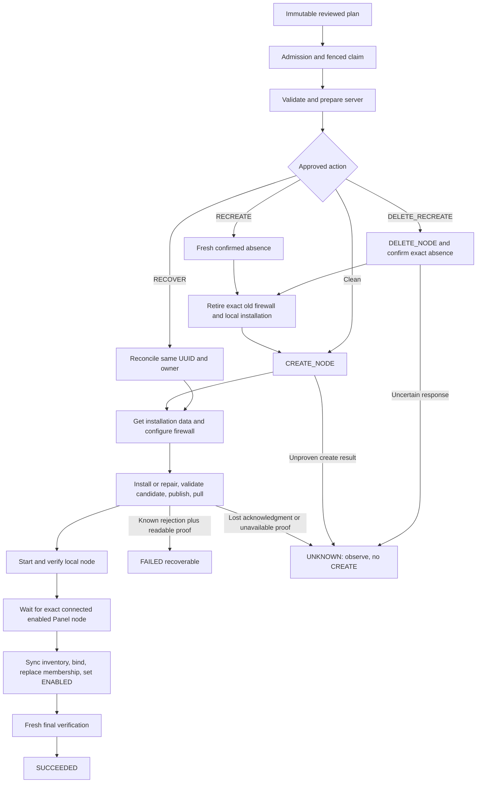

# Stage 25 Remnawave re-fix

Stage 25 is reopened. Implementation changes code, tests and documentation only. It does not
deploy, contact a VPS/Panel, delete a node, alter an old workflow or clean the live fixture.
The preserved first acceptance node is `b745e2e1-bee0-468f-a2fa-318693ac3502`.
The only permitted final code verdict after all relevant exact-SHA CI jobs succeed is
**CODE READY FOR LIVE ACCEPTANCE**. Stage 25 remains **NOT ACCEPTED**.

## Baseline and delivery

Fresh `origin/master` before implementation was `7601936543eac0c58decc3205cd330866e6a7158`,
identical to the reported production baseline: no parallel fix delta was present.
The delivery message identifies final master SHA, commit list, exact-SHA push run and job results.
The user's pre-existing AGENTS.md edit is excluded from delivery.

## Changes and invariants

| Requirement | Implementation and evidence |
| --- | --- |
| BLOCKER 1: Compose base directory | `ManagedNodeCompose.validation` supplies intended project directory, candidate and interpolation env file. Initial staging, final repair, Stage25F forward switch and rollback use it. Published-file config checks already have Compose in its own directory. CAS, validation before commit and private `.env` remain intact. |
| BLOCKER 2: real Compose | `ManagedNodeComposeSpec` runs installed `docker compose config -q` without a daemon/pull/container in four separate project fixtures. Each positive command passes and its negative control without project directory fails. It uses the production renderer and command helper; diagnostics are discarded and processes have a bounded timeout. Mocked Docker in the Linux harness is separate evidence. |
| BLOCKER 3: identity vs target | New recovery proof optionally carries `previousImageReference`; absent field preserves legacy decoding. RECOVER spec, recovery observation and fleet provenance use original installation image/owner. Retiring old state uses previous image and previous CIDRs; a new install uses current reviewed target. Catalog release/generation checks replace string equality. Shared Stage25F shell proof validates controlled image evolution before use; repair retains the controlled image line and retirement checks the container against it. |
| BLOCKER 4: FAILED vs UNKNOWN | Installation/repair distinguishes intrinsic uncertainty from deterministic command rejection. After known failure following mutation it runs fresh bounded read-only local classification outside DB transactions. OWNED_PARTIAL and other known states produce known failure; unavailable proof, lost acknowledgment, timeout and truncation remain UNKNOWN. Worker propagates the typed uncertainty flag. |
| Canonical inbound set | Normalization rejects duplicates and sorts UUIDs; recovery compares canonical inputs without rewriting old snapshots. |
| Typed DELETE absence | Only exact A011 / Node not found at the expected canonical `/api/nodes/<UUID>` endpoint with validated typed envelope counts as Deleted. Wrong UUID, arbitrary/malformed 404 and uncertain failures remain UNKNOWN. Race regression performs one DELETE. |
| Deletion with UNKNOWN | Ordinary DELETE returns 409 INTEGRATION_RECOVERY_REQUIRED. A separate POST `abandon-recovery-and-delete`, guarded by ManageIntegrations, records explicit abandonment and tombstones/removes credential atomically. UI requires a second confirmation in RU/EN. Active work remains blocked, and no remote mutation occurs. |
| Cleanup residue | Existing exact owner/UID/root-stage/upload checks make leftover candidates and private uploads OWNED_PARTIAL (unsafe residue FOREIGN), preventing local/final success. Injected failed cleanup commands leave residue visible; subsequent exact-owner cleanup converges. No secret content is printed. |
| Append-only schema | V57 adds the shared unresolved-UNKNOWN predicate, a database tombstone guard and one audit action. V48–V56 are unchanged. No terminal snapshot, journal or fleet history is rewritten. |

Unresolved node-action/config-write UNKNOWN uses the existing fresh inventory observation gate.
An onboarding UNKNOWN remains unresolved until a successful recovery descendant. UNKNOWN rollout
and image-upgrade history blocks ordinary deletion conservatively; operators can explicitly abandon
recovery. The application check and direct-write DB guard use the same tenant-scoped SQL function.

## Execution route and crash boundaries



| External mutation | Before dispatch / during / after lost acknowledgment / after durable progress |
| --- | --- |
| Server Profile baseline | Approved child identity is attached durably; deterministic parent request ID starts only PLANNED child. Existing child journal/claim reconciles its own mutation. Parent waits then observes pinned compliance. |
| Panel create | Phase begins durably before POST. Restart/uncertain response reads exact correlation and full intent; it does not repeat POST. Proven UUID persists before installation work; ambiguity is UNKNOWN. |
| Panel delete | Explicit approval and fresh exact identity check precede one DELETE. Uncertain result is UNKNOWN; a new plan observes absence. Typed already-absent response still passes CONFIRM_NODE_DELETED before any retirement/create. |
| Firewall configure/retire | Exact namespace and source/protocol/port rules, current UFW state and SSH canaries precede changes. Restart reconciles exact owned rules. Foreign/Server Profile rules survive; uncertain observations stop the chain. |
| Ownership/staging/files | Atomic owner claim, private file staging, hashes/CAS, fsync and atomic publish expose deterministic partial states. Before/after owner, env, compose, metadata and publish boundaries are covered by extracted production scripts and SSH orchestration tests. |
| Pull/start | Published installation is proved before pull. Deterministic pull rejection with re-observed complete files is FAILED. Timeout/lost reply remains UNKNOWN. One Compose up is followed by fresh runtime/port/stability and Panel evidence. |
| Sync/binding/desired | Sync session is recorded atomically with claim, observation is external. UUID-based inventory import and strict binding are short transactions. Existing replacement function is fenced and idempotent; ENABLED intent is handled by the existing action engine. |
| Config deployment/rollout | Typed deployment child persists request before PATCH; unknown result requires observation. Fleet gates fresh config/node evidence, excludes conflicting engines, journals compensation, and never derives rollback from unproven writes. |
| Image forward switch | Durable member/action records precede mutation. Restart recognizes exact baseline, committed-only Compose target or verified target runtime; it either continues the known activation step or returns UNKNOWN. Image config IDs, catalog evidence, CAS and lease authorization fence each boundary. |
| Image rollback | Uses the same candidate switch helper and original installation proof, with pinned previous immutable image. Only recorded successful forward switches are candidates. Committed-only rollback activation is reconciled; unexpected runtime is UNKNOWN. |

## Transaction, concurrency and performance review

Selection/read projections remain separate from mutation. SSH, HTTP, registry verification,
Docker and remote file I/O run in IO outside database transactions. Existing workers persist a
phase/action boundary, release the DB transaction, dispatch the external operation and save the
result under live claim-token/deadline fencing. V57 deletion contains DB checks, audit, tombstone
and credential removal only; no external I/O or new long transaction.

Existing ownership admission order remains integration → fleet advisory/row ownership →
resource/member/workflow rows. V54 reciprocal onboarding/action/rollout/upgrade triggers,
V55 tombstone admission and V56 lease-only observer/desired-state lock-order exceptions remain.
V57 adds a read-only predicate under the integration deletion lock; it acquires no reverse locks.

PostgreSQL regressions cover reciprocal action/onboarding, paused workflows, competing fleet
rollout/image starts, recovery vs fleet start, two recovery starts, stale/fresh fencing, concurrent
integration deletion and action admission, replacement idempotency/conflict, and observer lock order.
Replacement retains one active membership, increments its version once, removes old assessment/image
facts, schedules observation and preserves the immutable replacement record.

Onboarding options remain four SQL statements for 1/100/500 resources. For 1/10/100/500 members,
fleet stored evidence uses 2 statements, eligible SSH sources 2, member rows 2, image observations 1
and rollout facts 1, unchanged before/after. Fleet overview, upgrade facts and verification use
set-based batch projections and map indexes. The new
image-identity columns change projection expressions only: no per-member SQL or provider requests.
Deletion adds one SQL predicate call (and the DB guard rechecks it); it is independent of member count.
Fresh pre-destructive provider/SSH checks remain intentional and have not been batched away.

## Verification and acceptance limits

Domain tests cover canonical inbounds, catalog identity evolution and V1/V2 decoding. Worker tests
cover UUID/owner reuse without create, distinct old/new image specs, known/uncertain repair results,
all local states and phase restarts. PostgreSQL covers fresh schema, V52 and V56 → V57, CI V29/V41
backup fixtures, legacy terminal/journal/fleet preservation and the new tombstone guard.
Linux safety tests run extracted production scripts and inject cleanup/retirement failures; they
cover symlinks, hardlinks, UID/GID/mode, special parent modes, conflicting stages, extra files,
foreign containers/listeners and controlled image-line edits. They mock Docker. The mandatory
real Compose test separately proves parser/base-directory semantics.

Local validation: `sbt testFull` reports 1292 total, 1273 passed, 18 POSIX checks and the one
opt-in live deployment contract test skipped,
zero failures/errors with real PostgreSQL 17.11 and installed Docker Compose v5.0.2. The four real
Compose contexts pass their positive checks and fail their negative controls. `Universal / stage`
passes. Frontend reports 762 passed across 85 files; production build passes. Existing ScalaDoc
link/deprecation and frontend chunk-size warnings remain. A contention-induced 30-second timeout
in the 500-member fixture during an earlier full run was followed by a passing full run without
changing timeouts, fixture size, production behavior or validation requirements.

Implementation commit `aa8832f99660e331ef09516f6745f94f04dab92f` passed full
[push CI 37601287530](https://github.com/dmitriyuser047/infradesk/actions/runs/37601287530):
backend, frontend, images, Ubuntu 22.04 and Ubuntu 24.04 all SUCCESS. Linux backend reports
1292 total, 1291 passed, one opt-in live deployment contract test skipped, no failures/errors.
PostgreSQL and real Compose tests are mandatory in that run. The delivery message records the
exact final HEAD push run, including documentation corrections. Local Windows POSIX skips are
distinct from Linux execution; the opt-in live test remains part of operator acceptance.

Operator acceptance begins with the preserved UNKNOWN run: deploy the fixed exact SHA, check
`application.started gitSha` and Flyway V57, then Check again. It must show the same external UUID,
OWNED_PARTIAL, no new CREATE POST, repair the existing staging and complete all final evidence.
Verify Panel identity/profile/inbounds, one container and reviewed runtime image, .env 0600,
no secret-bearing residue, port 2222, exact new UFW namespace with old namespace absent, unchanged
Server Profile 22/8080 rules, immutable old/new histories, binding/ENABLED intent and exactly one
active fleet membership with fresh evidence.

The operator must then execute the request's disposable-object live matrix: clean/repeat onboarding,
crashes after owner/env/compose/publish and each recovery, uncertain create/delete, exact NOT_FOUND
recreate, delete/recreate, membership replacement, config canary, reviewed image upgrade and recovery,
rollback and recovery, automatic rollback, backend restart, uncertain frontend submit/reload and
same-request retry. These live checks have not been performed by the implementation agent.

## Changed file inventory

Production code and migration:

```text
src/main/resources/db/migration/V57__integration_recovery_abandonment.sql
src/main/scala/application/integration/IntegrationManagement.scala
src/main/scala/application/integration/OnboardingRecoveryObservation.scala
src/main/scala/application/integration/RemnawaveOnboardingWorker.scala
src/main/scala/application/port/IntegrationActionRepository.scala
src/main/scala/domain/audit/AuditEvent.scala
src/main/scala/domain/integration/RemnawaveNodeRelease.scala
src/main/scala/domain/integration/RemnawaveOnboarding.scala
src/main/scala/infrastructure/http/IntegrationRoutes.scala
src/main/scala/integration/remnawave/RemnawaveClient.scala
src/main/scala/integration/ssh/ManagedNodeCompose.scala
src/main/scala/integration/ssh/SshManagedNodeImages.scala
src/main/scala/integration/ssh/SshRemnawaveNodeRemote.scala
src/main/scala/persistence/postgres/PostgresIntegrationActionRepository.scala
src/main/scala/persistence/postgres/PostgresRemnawaveFleetQuery.scala
src/main/scala/persistence/postgres/PostgresRemnawaveOnboardingRepository.scala
frontend/src/api/integrations.ts
frontend/src/i18n/en.ts
frontend/src/i18n/ru.ts
frontend/src/pages/IntegrationDetailPage.tsx
```

Tests and verification configuration:

```text
.gitattributes (LF for byte-hashed OCI fixtures on Windows)
.github/workflows/ci.yml (V57 backup/restore fixture boundaries)
src/test/resources/server-profile-safety/verify.sh
src/test/scala/application/audit/AuditUnitSpec.scala
src/test/scala/application/integration/OnboardingRecoveryObservationSpec.scala
src/test/scala/application/integration/RemnawaveOnboardingWorkerSpec.scala
src/test/scala/domain/integration/RemnawaveOnboardingSpec.scala
src/test/scala/infrastructure/database/DatabaseMigratorIntegrationSpec.scala
src/test/scala/infrastructure/http/IntegrationRoutesSpec.scala
src/test/scala/integration/remnawave/RemnawaveNodeProvisioningSpec.scala
src/test/scala/integration/ssh/ManagedNodeComposeSpec.scala
src/test/scala/integration/ssh/RemnawaveNodeRemoteSpec.scala
src/test/scala/persistence/postgres/IntegrationLifecycleSpec.scala
src/test/scala/persistence/postgres/NodeUpgradeIntegrationSpec.scala
src/test/scala/persistence/postgres/RemnawaveHardeningMigrationSpec.scala
src/test/scala/persistence/postgres/RemnawaveOnboardingIntegrationSpec.scala
frontend/src/pages/IntegrationDetailPage.test.tsx
```

Documentation: this report, `stage25c-onboarding.md` current lifecycle and
`remnawave-hardening-review.md` reopened acceptance boundary. OCI fixture bytes/catalog digests,
V48–V56 migrations and the user's AGENTS.md edit are unchanged in the delivery commit.
